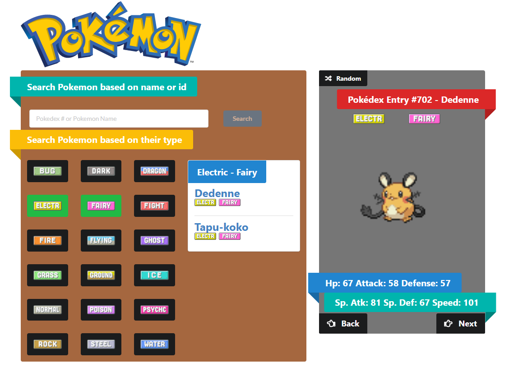
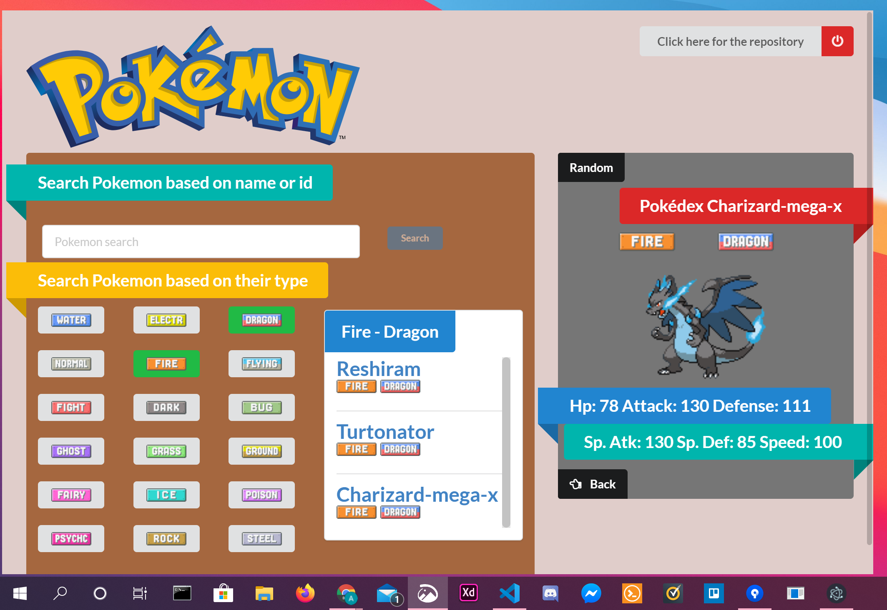

### This Project is my attempt at creating an index that makes asynchronous queries to an api ([PokéAPI](https://pokeapi.co/)), based on the name or type submitted on the left.


## Quick Instructions

The Pokédex can be viewed [here](https://ahmedalihashi.github.io/pokedex/).

## Windows Application
You can download the pre-built version [here](https://1drv.ms/u/s!AoQhMrJoJDR62ljYFqMjK4uWhrGi?e=8xhMuP)   
Alternativly you can build your own version locally

```
git clone https://github.com/AhmedAlihashi/pokedex.git
cd electron
npm install or yarn install
npm run build-win or yarn build~win
```

## ScreenShot

</img>
</img>
