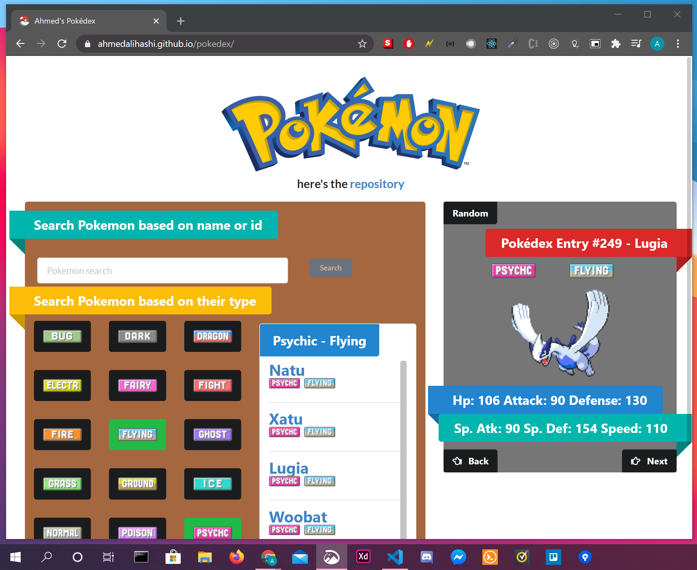

### This Project is my attempt at creating an index that asynchronously quieries an api ([PokéAPI](https://pokeapi.co/)), based on the name submitted on the left.

## Instructions

The Pokédex can be viewed here can be viewed [here](https://ahmedalihashi.github.io/pokedex/).

## ScreenShot

</img>

_if you're reading this im in the process of upgrading the responsive ui system on this app, the content lib im using that handles it became buggy & eventually got depreciated. the IsTablet/IsMobile functions are temporary_
